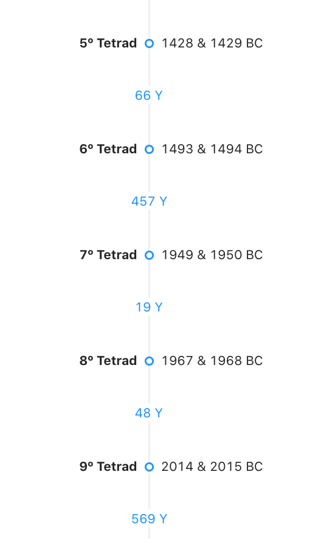

# Moon Tetrads Research

These are the Tetrads found on the Nasa catalog wich fall on Passover or Sukkot. Hebcal.com is used to find the Jewish holidays.

Check the site: https://moon-tetrads.herokuapp.com/

